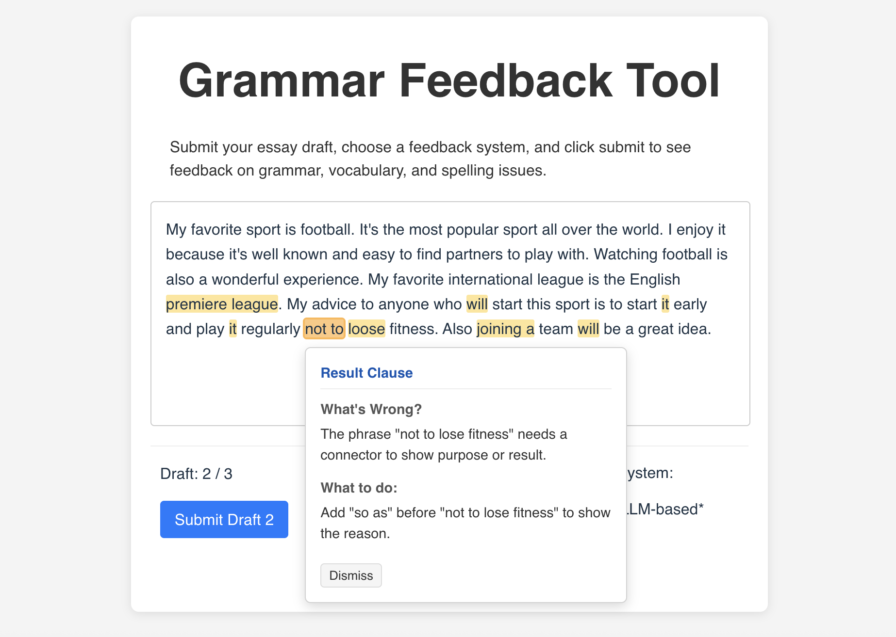

# Grammar Feedback UI

A simple text editor interface with a feedback comment feature.

The system highlights spans of interest and produces feedback "cards" when users click the highlights.

The default back end logic can be handled by `https://github.com/coynestevencharles/grammar_feedback_api`

## Screenshot



## Getting Started

Download [Node.js](https://nodejs.org/)

Install dependencies:

```bash
npm install
```

Configure `VITE_API_BASE_URL` in `.env`

To launch for local development:

```bash
npm run dev
```

Then open your browser and navigate to `http://localhost:5173`
