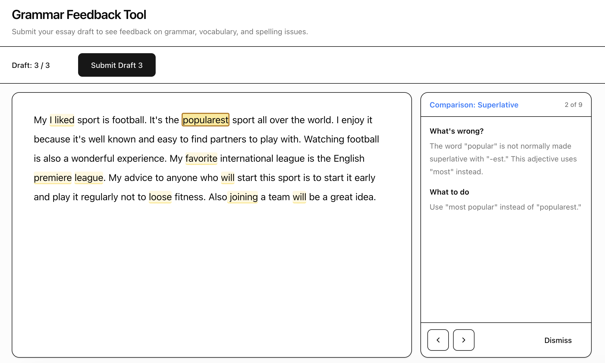

# Grammar Feedback UI

A Plate-based text editor interface with a feedback comment feature.
The application highlights text spans returned from a feedback generation API,
and shows one selected feedback comment at a time. These are displayed in a sidebar on desktop, or a bottom dock on mobile, with previous, next, and dismiss controls.

The default back end logic can be handled by `https://github.com/coynestevencharles/grammar_feedback_api`

## Screenshot



## Getting Started

Install Node.js 24 LTS and npm 11. The repository includes an `.nvmrc`, so nvm
users can select the supported runtime with:

```bash
nvm install
nvm use
```

Install the locked dependencies:

```bash
npm ci
```

Configure `VITE_API_BASE_URL` in a local `.env` when the default
`http://localhost:8000` is not appropriate.

Application behavior is configured in `src/config.ts`:

- Set `demoMode` to `true` to load `GET /pipelines` at startup and show a
  selector containing every deployed backend pipeline. The reported default is
  selected initially, and the regular submit button uses the current choice.
  This is a good option when manually testing the default multi-pipeline back
  end.
- Set `maxDrafts` to a positive number to label and limit drafts, or `null` to
  allow unlimited submissions with a plain **Submit** button.

The frontend continues sending an incrementing `draft_number` when the visible
draft limit is disabled because that field is part of the backend request
contract.

To launch for local development:

```bash
npm run dev
```

Then open your browser and navigate to `http://localhost:5173`

## Development checks

```bash
npm run check
npm test
npm run format:check
npm run lint
npm run build
```

`npm run check` runs the formatting, lint, tests, and production
build checks used by the pre-commit hook. Husky installs the hook automatically
when dependencies are installed. If Git was initialized after `npm ci`, install
it manually with:

```bash
npm run prepare
```

Prettier is the repository formatter. Apply it with:

```bash
npm run format
```

## Tests

```bash
npm test
npm run test:watch
npm run test:coverage
npm run test:e2e
```

Testing is done with Vitest, React Testing Library, and Playwright.

The Playwright test uses Chromium to check the Plate editor and other UI elements.
To use this, install that browser once with `npx playwright install chromium`.

Coverage and Playwright are intentionally not part of pre-commit: coverage has
no threshold, and Playwright requires a separately installed browser. Run them
when reviewing test breadth or browser behavior.
